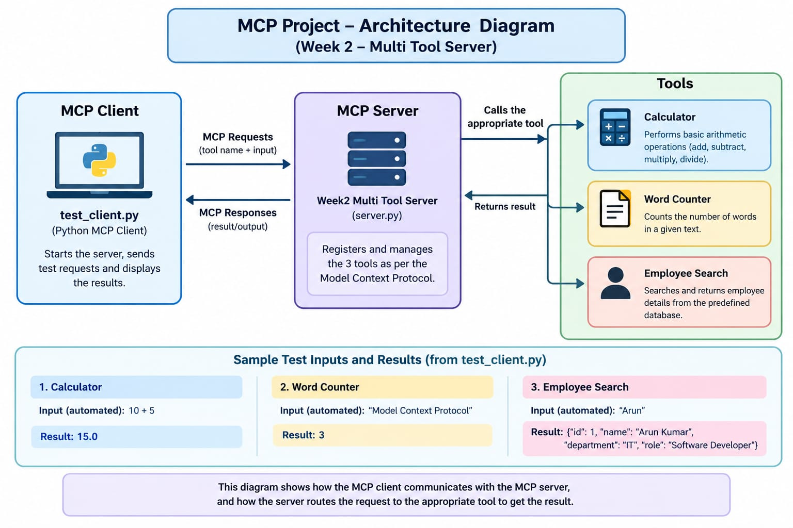

# Week 2 MCP Multi-Tool Server

## Overview

This project demonstrates a basic Model Context Protocol (MCP) server developed using Python.

The server provides three useful tools that can be accessed by an MCP-compatible client:

1. Calculator
2. Word Counter
3. Employee Search

## Technologies Used

- Python 3.14.7
- Model Context Protocol (MCP) SDK 2.3.0
- Visual Studio Code
- Python Virtual Environment

## Project Structure

MCP-Week2/
│
├── venv/
│
└── mcp_server/
    ├── server.py
    ├── requirements.txt
    └── README.md

## Tools

### 1. Calculator

The Calculator tool performs basic arithmetic operations.

Supported operations:

- Addition
- Subtraction
- Multiplication
- Division

Example:

calculator(10, 5, "add")

Result:

15

### 2. Word Counter

The Word Counter tool counts the number of words in a given text.

Example:

word_counter("Model Context Protocol")

Result:

3

### 3. Employee Search

The Employee Search tool searches a sample employee database using an employee's name.

Example:

employee_search("Arun")

It returns matching employee details such as:

- Employee ID
- Name
- Department
- Role

## How to Run

### Step 1: Activate the Virtual Environment

Windows:

venv\Scripts\activate

### Step 2: Install Dependencies

python -m pip install -r mcp_server\requirements.txt

### Step 3: Open the MCP Server Folder

cd mcp_server

### Step 4: Start the Server

python server.py

The server will start and wait for an MCP client connection.

## MCP Server Architecture

The MCP client communicates with the MCP server.

The MCP server provides three tools:

Client
   |
   v
MCP Server
   |
   +---- Calculator
   |
   +---- Word Counter
   |
   +---- Employee Search

### Architecture Components

1. MCP Client

The MCP client sends requests to the MCP server and receives the results.

2. MCP Server

The MCP server manages and exposes the available tools.

3. Calculator Tool

Performs arithmetic operations such as addition, subtraction, multiplication, and division.

4. Word Counter Tool

Processes text and returns the number of words.

5. Employee Search Tool

Searches the sample employee data and returns matching employee information.

## Requirements

The project uses the following MCP package:

mcp==2.3.0

The complete dependency information is available in requirements.txt.

## Conclusion

This project demonstrates how an MCP server can expose multiple tools through a common interface.

The three tools demonstrate different types of functionality:

- Calculator demonstrates computation.
- Word Counter demonstrates text processing.
- Employee Search demonstrates data retrieval.

The project provides a foundation for developing more advanced MCP-based applications.
